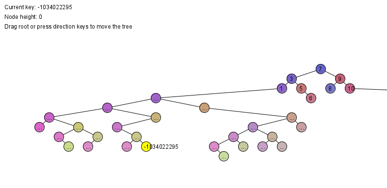

# Tree Visualizer


During the Data Structure and Algorithms course, the Tree that implemented is not visible, which cause difficulties in debugging. This project implement a visualizer to real-time visualize the tree, make it easy to debug and learn the Tree structure.

## Getting Started


### Prerequisites
The Node class used by your tree should be exactly the same as the one in the Tree.java of this project.

The visualizer depends on Processing.core, add Processing.core to your build path manually or using Maven to build

If you are using Maven, add following to pom.xml
```
  <dependencies>
    <dependency>
        <groupId>org.processing</groupId>
        <artifactId>core</artifactId>
        <version>2.2.1</version>
    </dependency>
  </dependencies>
```
The version of processing used is Processing 2.2.1. If you are using processing 3 or above, in the Visualizer class, you should change the setup() method name to settings() like following.
```
public void settings() {
        size(width, height);
    }
```


## Visualize your Binary Search Tree

Except the Node class, you do not need further modify your code. You can simply pass your Tree instance to the static fields in the Visualizer class.

### Call the Visualizer

#### Visualize Tree with Node implementation

```
Tree t = new Tree();
Visualizer.treeVisualize(t); 
```
#### Visualize Tree with array implementation
Like Heap data structure implemented using array, you can all the heapVisualize() method. The heapVisualize() method will parse the array to the Node Tree, and pass to the treeVisualizer.
The only requirement is your array should stratify the format such that the first element(index 0) should store the count of elements stored in the array. The heapVisualize() only support integer data type.

```aidl
int[] treeArray = {5,1,2,3,4,5}; //The first element 5 indicates the element count
Visualiezer.heapVisualize(treeArray); 
```


### Sample Visualized Tree


## Built With

* [Maven](https://maven.apache.org/) - Dependencies Management
* [Processing](https://processing.org/) - External library


## Authors

* **Yifeng Carter CHENG** - *Initial work* - [Cyfine](https://github.com/Cyfine/)


## License

This project is licensed under the Apache License 2.0 - see the [LICENSE](LICENSE) file for details


